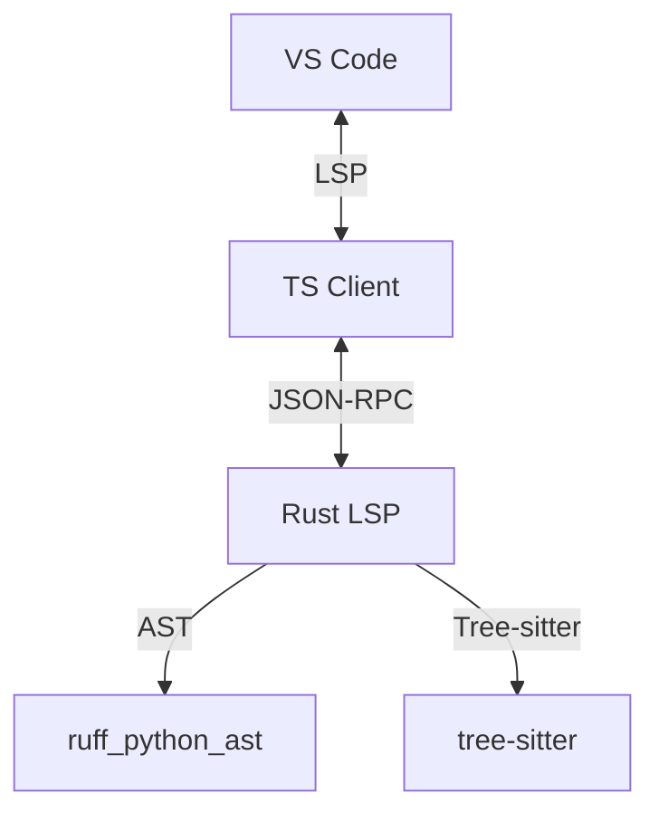

# Django IDE Extension

[](https://marketplace.visualstudio.com/items?itemName=django-ide.django-ide-extension)
[](https://microsoft.github.io/language-server-protocol/)
[](https://www.rust-lang.org/)
[](LICENSE)

Rust-powered LSP server for Django. Autocomplete, view-to-template navigation, N+1 detection, migration analysis.


---

## What it does

### View-to-template autocomplete

If VS Code knows `home.html` is rendered by `HomeView`, autocomplete knows it too. Type `{{` and context variables show up. Type `{{ user.` and you get `.username`, `.email`, etc.

```python
# views.py
class HomeView(TemplateView):
    template_name = "home.html"

    def get_context_data(self, **kwargs):
        context = super().get_context_data(**kwargs)
        context["posts"] = Post.objects.all()
        context["categories"] = Category.objects.all()
        return context
```

```django
{{ posts.  # autocomplete: .all, .count, .exists, Post fields
{{ categ  # autocomplete: categories (from the view)
```

Also completes tags, filters (``, ``, `{{ value|date:"Y" }}`), inclusion tags.

### View ↔ template navigation

- Ctrl+Click `render(request, "home.html")` → opens the template.
- From inside a template, "Go to View" → lists the views that render it.

### Hover

Hover a template variable to see its inferred type, origin view, and available fields.

```django
{{ user }}  →  User (from home_view)  .username, .email, .date_joined
```

### ORM

Autocomplete for `annotate`, `values`, `select_related`, `prefetch_related`, custom managers. Navigation between models and fields.

```python
Post.objects.select_related("author").filter(
    author__  # autocomplete: username, email, profile, date_joined
)
```

### Static N+1 detection

Analyzes code without running it. Catches patterns like:

```python
for post in Post.objects.all():  # N+1: Post.objects.all() followed by post.author.name
    print(post.author.name)
```

Suggests a quick-fix with `.select_related("author")`. Works with `.first()`, `.last()`, `.get()`, nested loops, and template variable access.

It doesn't always get it right. False positives happen — especially when the relation was already loaded earlier or when the access is conditional. Diagnostics emit as warnings, not errors.

### Migration analysis

Scans migration files and flags risky operations:

- Adding a non-nullable field without a default
- Column changes that can lock tables on MySQL
- Removing fields that are still referenced

False positives here too. Flagged operations aren't always a problem — depends on table size, database engine, timing. Use your judgment.

---

## How it works



1. The TypeScript client talks to VS Code, discovers the workspace, and finds the virtualenv (via ms-python).
2. The Rust server indexes views, maps routes, resolves CBVs, parses templates, and runs diagnostics.

The server runs as a separate process. If it crashes, VS Code restarts it automatically.

---

## Configuration

```json
{
    "djangoIde.templateDirs": ["**/templates"],
    "djangoIde.pythonExecutable": null,
    "djangoIde.diagnostics.n1": true,
    "djangoIde.diagnostics.migrations": true
}
```

| Setting | Type | Default | Description |
| :--- | :--- | :--- | :--- |
| `djangoIde.templateDirs` | `string[]` | `["**/templates"]` | Template directories to scan |
| `djangoIde.pythonExecutable` | `string` | `null` | Path to Python (falls back to active virtualenv) |
| `djangoIde.diagnostics.n1` | `boolean` | `true` | Enable/disable N+1 detection |
| `djangoIde.diagnostics.migrations` | `boolean` | `true` | Enable/disable migration analysis |

---

## Current limitations

- View-to-template autocomplete only works when the view uses `TemplateView`, `render()`, or `render_to_response()`. If context is passed indirectly (middleware, complex mixins), it may not resolve.
- `` resolution is basic. Dynamic includes (with a variable) are not followed.
- The N+1 detector is static — it doesn't run the code. If the query was already optimized elsewhere in the flow, it still fires.
- Migration analysis doesn't connect to the database. It only reads migration files.
- Projects with highly dynamic `urlpatterns` (generated in loops, complex regex) may break view-to-template navigation.

---

## Issues

Use the tracker for:
- Bugs (autocomplete not working, wrong navigation, crashes)
- Feature ideas
- Questions about behavior

The core engine is closed-source, but the tracker is public.

Check [CONTRIBUTING.md](CONTRIBUTING.md) before opening an issue.
