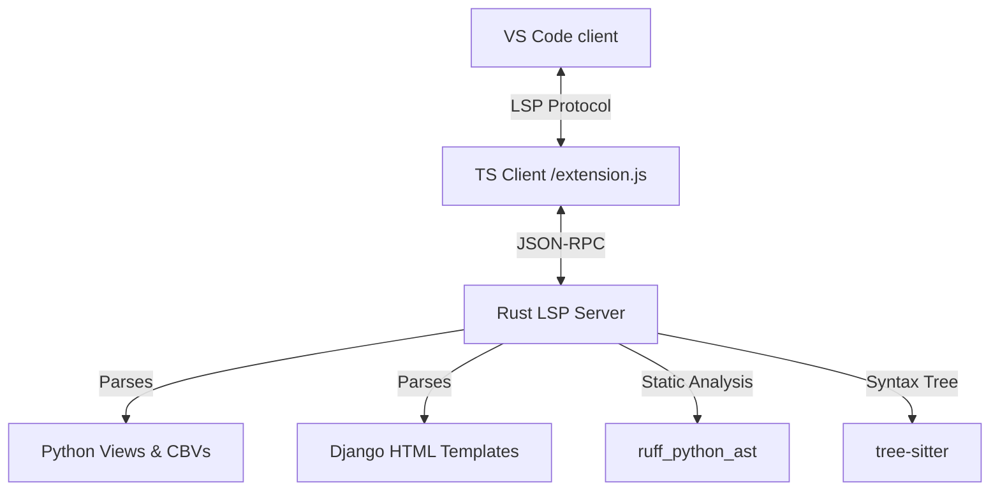

# Django IDE Extension

Bring **PyCharm-like productivity** to your Django templates and Python views inside VS Code. The **Django IDE Extension** bridges the gap between your backend Python views and your frontend Django templates, offering deep static analysis, real-time database intelligence, and automated performance profiling.

This repository serves as the public community hub for documentation, issue tracking, feature requests, and releases.

---

## Key Features

### ⚡ Smart Context Auto-completion
* **View-to-Template Context Resolution:** When editing a template (e.g., `home.html`), the extension automatically identifies which views render it and extracts context variables. Typing `{{` will autocomplete variables passed via the view.
* **Intelligent Attribute Completion:** Get completion suggestions for model fields and properties on context variables (e.g., `{{ user.` suggests `.username`, `.email`, etc.).
* **Tags, Filters & Inclusion Tags:** Complete standard Django blocks, common filters (`|lower`, `|default`), custom template tags loaded via ``, and inclusion tags.

### 🔍 Instant View-to-Template Navigation
* **Go to Template:** Ctrl + Click on a template name inside Python view functions or Class-Based Views (e.g. `render(request, "home.html")`) to open the HTML template instantly.
* **Go to View:** Use the `Django: Go to View` command inside any HTML template to search, select, and jump directly to the Python views that render it.

### 📚 Hover Documentation
* Hover over template variables to see their inferred type, the views they originated from, and documentation about their fields.

### ⚙️ Database & ORM Intelligence
* **QuerySet Autocomplete:** Smart autocomplete for custom Django managers and QuerySet operations (e.g. `annotate`, `values`, `select_related`, `prefetch_related`).
* **ORM Relationships & Fields:** Suggests field names, Meta options, and models during ORM relationship traversal and field definitions.
* **Migration Safety Analysis:** Analyzes your migrations statically to detect risky operations (such as adding non-nullable fields or blocking column alterations) before you run them.

### 🚨 Smart N+1 Query Static Detection
* **Static Profile Analysis:** Detects unoptimized database hits in parenthesized querysets, nested loops, `.first()`, `.last()`, and `.get()` operations, as well as template-side loop variable accesses.
* **Quick-Fix Actions:** Provides editor quick-fixes to automatically insert `.select_related()` and `.prefetch_related()` optimizations to resolve diagnosed N+1 problems.

---

## How It Works

The extension runs a modern client-server architecture:

1. **TypeScript Client:** Interacts with VS Code APIs, manages active workspaces, and resolves active virtual environments using the standard MS-Python extension.
2. **Rust LSP Server:** A high-performance server built in Rust. It utilizes `tree-sitter` and `ruff_python_ast` to index views, map routing, resolve Class-Based View (CBV) hierarchies, parse Django template structures, and compute static diagnostic checks instantly.

---

## Configuration Settings

You can customize the extension behavior inside your `settings.json`:

| Setting | Type | Default | Description |
| :--- | :--- | :--- | :--- |
| `djangoIde.templateDirs` | `string[]` | `["**/templates"]` | Custom directories to scan for Django templates. |
| `djangoIde.pythonExecutable` | `string` | `null` | Custom path to python interpreter (fallback to active virtualenv). |
| `djangoIde.diagnostics.n1` | `boolean` | `true` | Enable or disable static N+1 query warnings. |
| `djangoIde.diagnostics.migrations` | `boolean` | `true` | Enable or disable migration safety analysis. |

---

## Support & Issue Tracking

Since the core engine is private, please use this public repository's issue tracker for:
* **Bug Reports:** If autocompletions or navigations fail on specific Django/Python code patterns.
* **Feature Requests:** Ideas to improve Django integration inside VS Code.
* **LSP Issues:** Crashing, performance issues, or memory problems.

Please see [CONTRIBUTING.md](CONTRIBUTING.md) for guidelines on how to open issues or suggest documentation changes.
