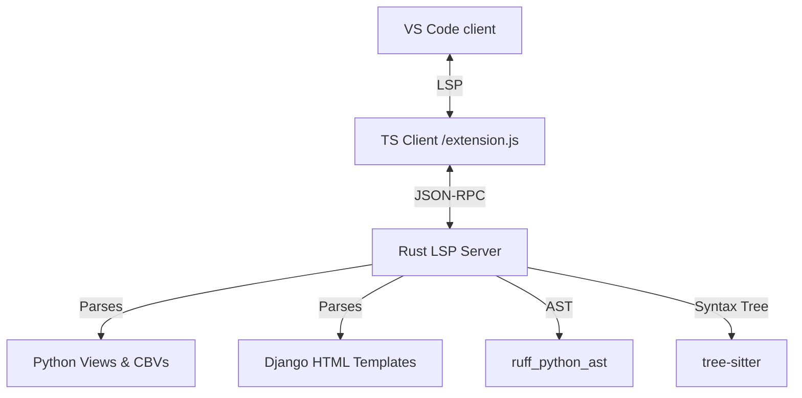

# Django IDE Extension

Write Django templates like you're in PyCharm — but in VS Code.

Context-aware autocomplete, instant view-to-template navigation, N+1 detection, migration safety checks. All backed by a Rust LSP server that doesn't get in your way.

---

## Features

### ⚡ Autocomplete That Actually Knows Your Views

Open a template like `home.html` and the extension already knows which views render it and what context variables they pass. Type `{{` and get your variables. Type `{{ user.` and get `.username`, `.email` — the works.

Also completes tags, filters (`|lower`, `|default`), custom `` tags, and inclusion tags.

### 🔍 Jump Between Views & Templates

- **Ctrl+Click** a template name in Python — `render(request, "home.html")` — and you're in the HTML file.
- **Go to View** from any template to find and jump to the Python view that rendered it.

### 📚 Hover Docs

Hover over a template variable and see its type, where it came from, and its fields. No more guessing.

### ⚙️ Database & ORM Intelligence

- Autocomplete for custom managers, `annotate`, `values`, `select_related`, `prefetch_related` — the whole QuerySet API.
- Field names, Meta options, relationship traversal — all suggested as you type.
- Migration safety analysis catches risky operations (non-nullable fields, blocking alters) before you run them.

### 🚨 N+1 Detection & Auto-Fix

Catches unoptimized queries in querysets, nested loops, `.first()`, `.last()`, `.get()`, and template loop accesses. Suggests quick-fixes that drop `.select_related()` / `.prefetch_related()` right where you need them.

---

## How It Works

1. **TypeScript Client** — Talks to VS Code, manages workspaces, finds your virtualenv via the MS Python extension.
2. **Rust LSP Server** — Indexes views, maps routes, resolves CBV hierarchies, parses templates, and runs diagnostics. All in Rust, all fast.

---

## Settings

| Setting | Type | Default | Description |
| :--- | :--- | :--- | :--- |
| `djangoIde.templateDirs` | `string[]` | `["**/templates"]` | Where to look for templates |
| `djangoIde.pythonExecutable` | `string` | `null` | Custom Python path (falls back to active virtualenv) |
| `djangoIde.diagnostics.n1` | `boolean` | `true` | Toggle N+1 warnings |
| `djangoIde.diagnostics.migrations` | `boolean` | `true` | Toggle migration safety checks |

---

## Issues & Feedback

The core engine is closed-source, but this repo is the public hangout for bug reports, feature requests, and docs.

Use the issue tracker for:
- **Bugs** — autocomplete failing on weird Django patterns? Navigation broken?
- **Ideas** — stuff you'd want to see in Django + VS Code integration
- **Crashes** — LSP going boom, memory leaks, performance gripes

Check [CONTRIBUTING.md](CONTRIBUTING.md) before opening an issue.
